# Reflowテスト
基板のリフローに関する知見をまとめるものです。

# オーブンの選定
まずはオーブンの選定方法についてです。

以前はホットプレートでのリフローが主流でしたが、基板上面の温度が上がりにくい、加熱のしすぎで基板が変色する等の問題があり、現在では両面加熱可能なトースターやオーブンでの簡易リフローが主流になりました。

おすすめはコンベクション機能がついている下記の二つになります。 

|型番|メーカー|出力|値段|
|---|----|----|---|
|TSF601K-C|TESCOM|1200W|13000円|
|ST-2D451|siroca|1400W|19800円|

私はTESCOM製のものを使用しています。

# ペーストはんだ
リフローには、ペーストはんだが必要になります。
現状購入可能なものだとchipquickのものが有名です。

https://www.chipquik.com/store/

ThermalStableシリーズというものが冷蔵保存なしで12か月持つので個人利用ならこのタイプを購入するのが良いです 

組成は、一般的な鉛フリーのTS391SNL250が一般的です。
オーブンの温度が230度ぐらい必要なので低温タイプでもよいと思います。 

|型番|メーカー|組成|温度|粒径|
|---|----|----|---|---|
|TS391SNL250|chipquick|Sn96.5/Ag3.0/Cu0.5|217-220℃|20-38um|
|TS391LT250|chipquick|Sn42/Bi57.6/Ag0.4|138℃|20-38um|

低温タイプは、便利な反面ビスマスを含むので取り扱いには注意が必要です。デバッグ時に通常のはんだごてで手直しを行うともろくなりクラックするので140度ぐらいまで温度が下がる小手を用意することをお勧めします。

# オーブンのテスト
リフローを始める前にオーブンの昇温レートがどのぐらいなのか確認したほうが良いです。(内部に熱電対を入れてロギングする)
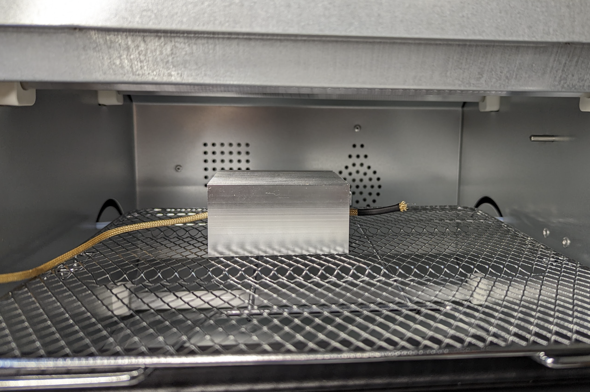

私が持っているTSF601K-Cの実験結果は下記のとおりです。
- 160℃設定で目的温度まで120秒はかかる
- 230℃設定では、3分以上かかる

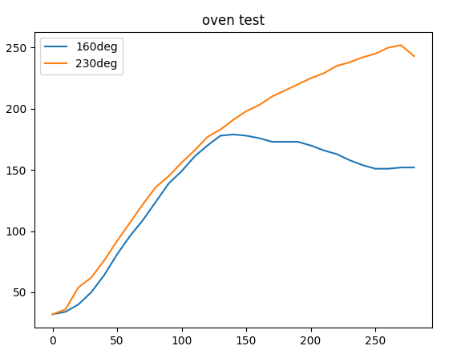

# ペーストはんだの印刷
オーブンのテストができたので、ここからはリフローの準備に入ります。 

まずスクレーパーナイフでペーストはんだをよく撹拌します。このひと手間により後段の印刷品質がかなり向上します。(2分ぐらいは混ぜたほう良いです)

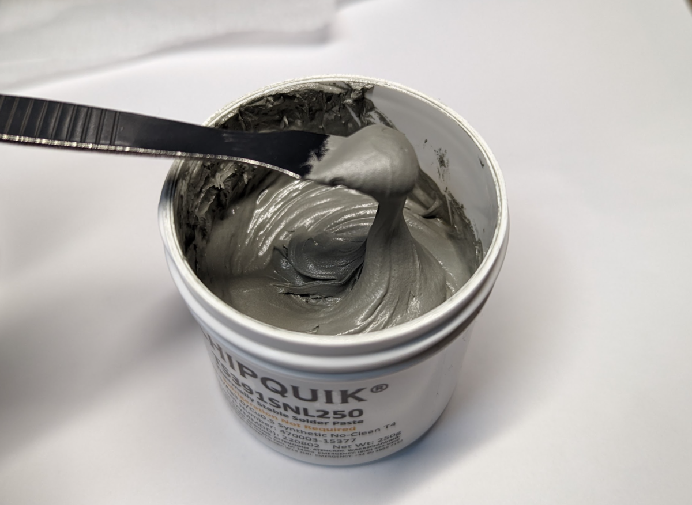

次に基板にメタルマスクを重ねて平行ピンで固定します。 
ここで基板設計の時に捨て板をつけておくのと固定用の穴をあけておくとスムーズに印刷ができると思います。

固定ができたらはんだペーストを盛ります。ここで取り出す量はケチらないほうが印刷成功のコツになります。
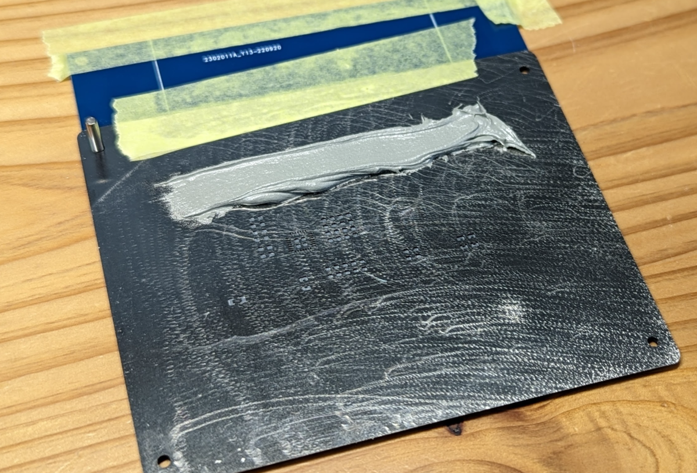

印刷には金属スクレーパーを使用すると失敗が少ないです。
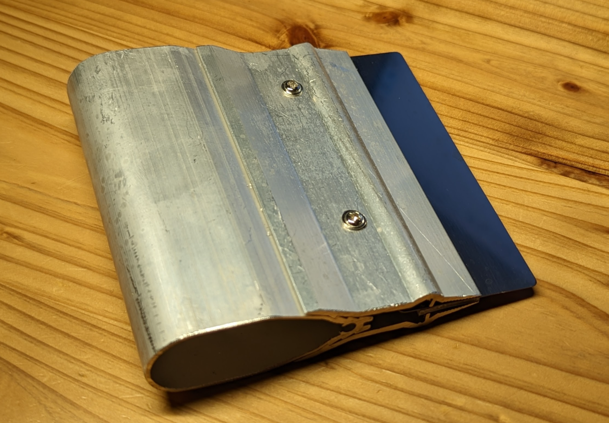

印刷が終わった基板が下記になります。
QFNもきれいに印刷できていることがわかると思います。

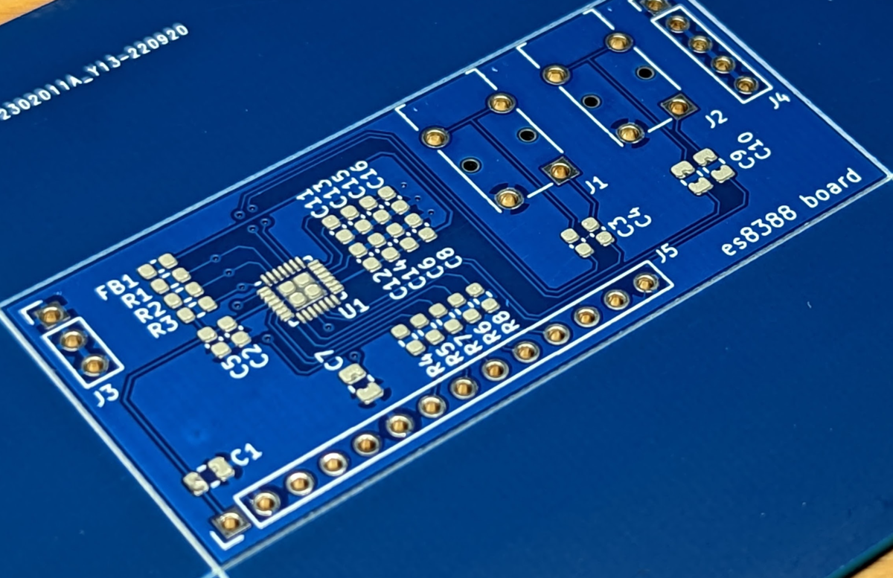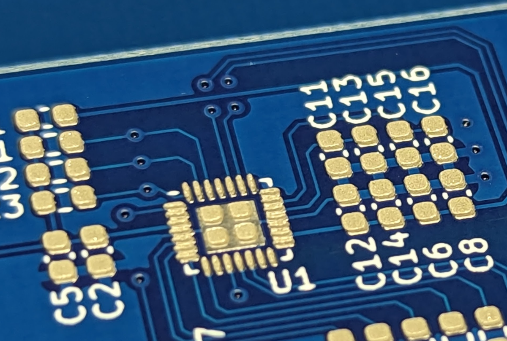

# 部品マウント
次に部品をマウントしておきます。
ICなど狭ピッチのものは、ブリッジする可能性があるので注意して載せてください。抵抗、コンデンサなどは、多少ずれてもセルフアラインメントが効くので気にしなくてよいです。
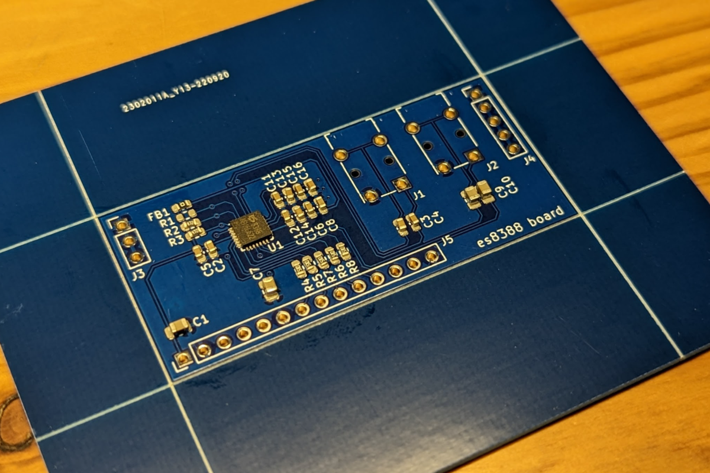

# リフローによるはんだ付け
部品が載せ終わった基板を慎重に炉に入れて条件温度にセットします。
基板投入前に70℃ぐらいで炉内を加温しておくと良いです。

基板投入後は、230℃設定にて半田が溶けるのを待ちます。
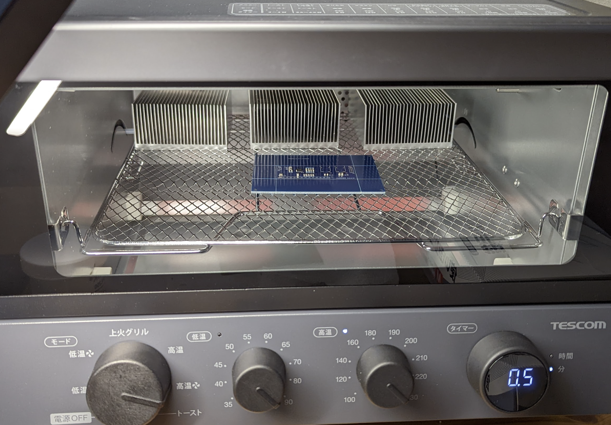

リフローが完了したらオーブンを開けて強制冷却します。 半田が固まる前につかむと部品がずれる可能性があるので十分に待ちます。

完了した基板がこちらになります。
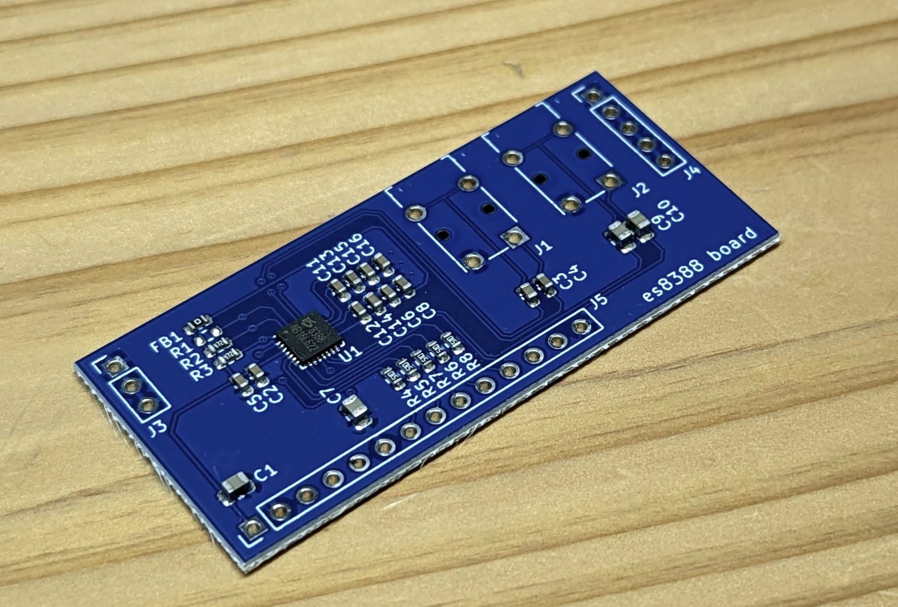

顕微鏡で確認するとQFNもきれいにはんだ付けできていることがわかります。
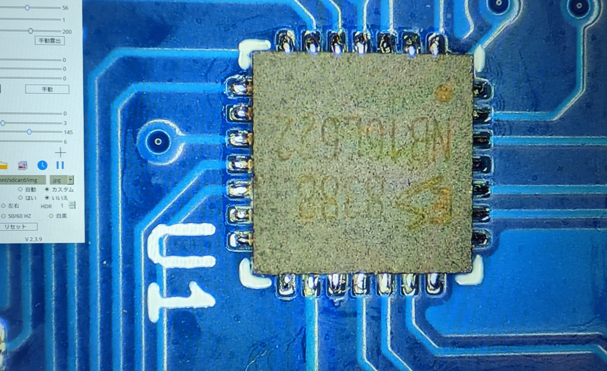

# 基板洗浄
基本的に趣味工作なので洗浄なしでもよいですが、はんだ付け品質によってはサイドボールが発生してショートの原因になるので洗浄を行うことをお勧めします。

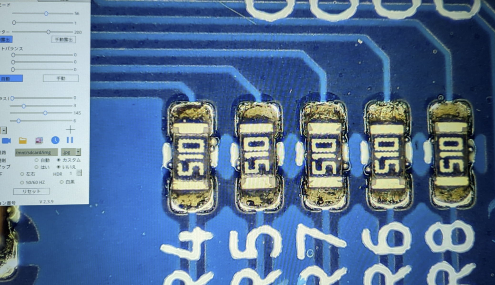